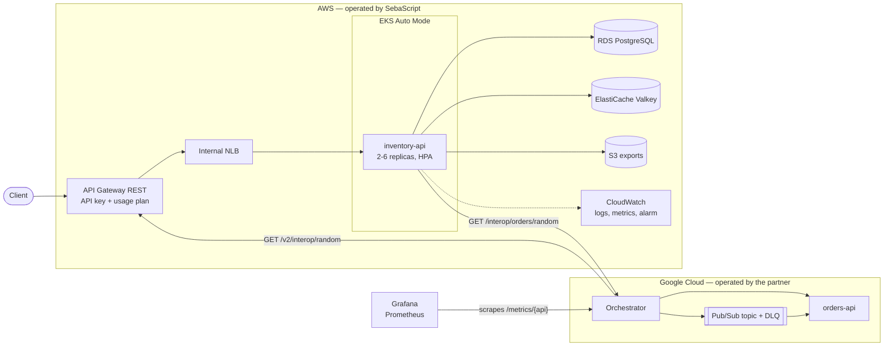

# Inventory API

RESTful inventory API with NestJS + TypeScript + PostgreSQL.

Every resource is served twice: at its bare path and under `/v2`. The two
versions are the same code today — `/v2` is the surface new behaviour will be
added to, without disturbing what already calls the original paths.

```bash
git clone https://github.com/SebaScript/inventory-api-v2.git
cd inventory-api-v2
cp .env.example .env

npm run docker:dev            # http://localhost:3000  ·  /docs  ·  /health
```

That builds the image and raises the API together with its PostgreSQL, so
Docker is the only thing you need installed. To run the API on your own machine
instead, `npm install` and `npm run start:dev`, with `npm run db:up` giving you
just the database.

There is nothing to migrate: TypeORM builds the schema from the entities on
boot (`synchronize: true`), which is convenient here and would be dangerous on
a database holding real data. `SEED=true` loads demo data, and the application
refuses to seed whenever `NODE_ENV=production`.

## Architecture

Two APIs, two clouds, one orchestrator between them. Each API is deployed whole
in its own provider and neither holds a copy of the other's data: a record from
the other side is fetched over HTTP, in real time, through the orchestrator.



### Who operates what

|                | Cloud        | Owns                                                                                                           |
| -------------- | ------------ | -------------------------------------------------------------------------------------------------------------- |
| **SebaScript** | AWS          | `inventory-api` on EKS, RDS, **the cache** (ElastiCache), **the object storage** (S3), API Gateway, CloudWatch |
| **Partner**    | Google Cloud | `orders-api`, **the orchestrator**, **the queue** (Pub/Sub + dead-letter topic)                                |

The group is two people rather than three, so the transversal components split
two-one instead of one-one-one. Each complete API still lives in a different
provider, and no component is duplicated across clouds.

### Why these services

| Need                            | Service              | Why this one                                                                                                                                         |
| ------------------------------- | -------------------- | ---------------------------------------------------------------------------------------------------------------------------------------------------- |
| API key that cannot be bypassed | API Gateway **REST** | API keys and usage plans exist only in REST APIs, not HTTP APIs. The NLB behind it is internal, so the key cannot be skipped by calling the balancer |
| Kubernetes                      | EKS **Auto Mode**    | Ships the load balancer controller, Pod Identity and the node monitoring agent. Fargate runs no DaemonSets, which rules out all three                |
| Database                        | RDS PostgreSQL       | The engine the app already speaks. Forces TLS from version 15                                                                                        |
| Cache                           | ElastiCache Valkey   | Shared by every replica, so a record fetched from the other cloud is reused across pods                                                              |
| Object storage                  | S3                   | Private bucket, reached through presigned URLs, so no object is ever public                                                                          |
| Monitoring in our own cloud     | CloudWatch           | Native, and the metric is written in EMF: no SDK, no API calls, no IAM permissions                                                                   |
| Monitoring across clouds        | Prometheus + Grafana | Open format, works in any provider, and reads both APIs through one orchestrator path                                                                |

## Versions

Versioning is NestJS URI versioning. The original controllers are declared
version **neutral**, so their paths did not change; only a controller that
declares a version gets a prefix.

|          | Base path                                  | Declared as     |
| -------- | ------------------------------------------ | --------------- |
| Original | `/groups`, `/items`, `/movements`          | version neutral |
| v2       | `/v2/groups`, `/v2/items`, `/v2/movements` | `version: '2'`  |
| v2 alias | `/api/v2/...`                              | url rewrite     |

Both versions read and write the same database through the same services, so a
record created through one is immediately visible from the other.

Everything under `/v2` also answers under **`/api/v2`**. It is a url rewrite
that runs before the router (`src/common/api-alias.ts`), not a second set of
routes: both spellings reach the same handler and report the same route
pattern, so no metric is split in two.

Each resource keeps its routes in a single abstract base controller with no
path and no version of its own. Both versions mount that base, so `/v2` starts
as an exact mirror and a future change there is declared by overriding one
method — everything else keeps coming from the base:

```ts
@ApiTags('Items v2')
@Controller({ path: 'items', version: '2' })
export class ItemsV2Controller extends ItemsControllerBase {
  constructor(service: ItemsService) {
    super(service);
  }
}
```

That constructor is not boilerplate that can be deleted. Without it TypeScript
emits no `design:paramtypes` for the class, and Nest injects `undefined`
instead of failing to start: the application boots green and the routes answer
`500`.

`/health` stays version neutral: it reports the process, not the API surface.

## API

The paths below are listed unversioned. Each one also exists under `/v2` with
identical behaviour.

### Groups: `/groups`

A group is a category. It is the dimension items are classified by.

| Method   | Path          | What it does                                                      |
| -------- | ------------- | ----------------------------------------------------------------- |
| `POST`   | `/groups`     | Creates a category. The name is unique, case insensitive          |
| `GET`    | `/groups`     | Lists categories, paginated. `?search` matches the name           |
| `GET`    | `/groups/:id` | Returns one category                                              |
| `PATCH`  | `/groups/:id` | Updates only the fields that were sent; the rest stay as they are |
| `DELETE` | `/groups/:id` | Deletes it, but only if it is empty — otherwise `409`             |

### Items: `/items`

An item is a product. It holds the **current state**: how much stock there is right now.

| Method      | Path                | What it does                                                                                                                               |
| ----------- | ------------------- | ------------------------------------------------------------------------------------------------------------------------------------------ |
| `POST`      | `/items`            | Creates a product inside a category. An optional opening stock is written as an `IN` movement, so even the first units have a ledger entry |
| `GET`       | `/items`            | Lists products with their category. Filters: `?search` (name or SKU), `?groupId`, `?lowStock`, `?status`                                   |
| **`QUERY`** | **`/items/search`** | Advanced search whose filter travels in the **body**: free text, a _list_ of categories and a price range                                  |
| `POST`      | `/items/search`     | The same search, for clients and tools that cannot send the QUERY verb                                                                     |
| `GET`       | `/items/:id`        | Returns one product, discontinued ones included                                                                                            |
| `PATCH`     | `/items/:id`        | Updates only the fields that were sent. The stock is never one of them. Also brings a product back with `{"status":"ACTIVE"}`              |
| `DELETE`    | `/items/:id`        | **Discontinues** it: it leaves the listings and accepts no more movements, but neither it nor its history is erased                        |

`QUERY` is a real HTTP method, safe and idempotent like `GET` but carrying a
request body. OpenAPI 3.0 has a closed list of methods that does not include
it, so the endpoint cannot appear in `/docs` as an operation — it is named in
the document description instead, and `POST /items/search` is an identical
alias for clients that cannot send the verb. Both exist under `/v2` too.

### Movements: `/movements`

A movement is an entry or exit of stock. It is the **immutable event log** that explains every unit — hence no `PUT`, `PATCH` or `DELETE`. A mistake is corrected with an opposite movement.

| Method | Path             | What it does                                                                                                                                                            |
| ------ | ---------------- | ----------------------------------------------------------------------------------------------------------------------------------------------------------------------- |
| `POST` | `/movements`     | Records an `IN` or `OUT` **and** updates the item's stock in a single transaction, with the row locked. `409` if there is not enough stock, and then nothing is written |
| `GET`  | `/movements`     | Lists the ledger, newest first. Filters: `?itemId`, `?type`                                                                                                             |
| `GET`  | `/movements/:id` | Returns one entry together with its product                                                                                                                             |

### Health: `/health`

| Method | Path      | What it does                                                               |
| ------ | --------- | -------------------------------------------------------------------------- |
| `GET`  | `/health` | Runs a real query against PostgreSQL. `503` if the database is unreachable |

### Errors

Every failure has the same shape. Branch on `code`, not on `message`.

```jsonc
{
  "statusCode": 409,
  "code": "INSUFFICIENT_STOCK",
  "message": "Item 1 has 75 unit(s) available, 99999 requested",
  "available": 75,
  "requested": 99999,
  "path": "/movements",
  "timestamp": "2026-08-18T15:29:44.337Z",
}
```

| Status | When                                                                           |
| ------ | ------------------------------------------------------------------------------ |
| `400`  | Validation failed (body, params, query)                                        |
| `404`  | The resource does not exist                                                    |
| `409`  | Duplicate name/SKU, non-empty group, discontinued item, **insufficient stock** |
| `422`  | A database rule was broken                                                     |
| `500`  | Unexpected — generic message only, details go to the log                       |
| `503`  | Health check: PostgreSQL unreachable                                           |

In production an unexpected error returns only `"Internal server error"`. A test asserts that a thrown error containing a password never appears in the response.

## Database

```
      Group                          Item                        Movement
  ┌───────────┐                 ┌────────────┐               ┌────────────────┐
  │ id        │                 │ id         │               │ id             │
  │ name  (U) │ 0..N       1..1 │ group_id   │          0..N │ item_id        │
  │ descrip.  │◄──── clasifica ─┤ sku    (U) │◄─── registra ─┤ type  (IN|OUT) │
  │ created   │                 │ quantity   │          1..1 │ quantity  > 0  │
  │ updated   │                 │ min_stock  │               │ resulting_stock│
  └───────────┘                 │ unit_price │               │ reason         │
                                │ status     │               │ created_at     │
                                └────────────┘               └────────────────┘
                ON DELETE RESTRICT            ON DELETE RESTRICT
```

| Rule                                   | Why                                                             |
| -------------------------------------- | --------------------------------------------------------------- |
| `UNIQUE` name on groups                | One category per name; the API also compares case-insensitively |
| `UNIQUE` sku (stored uppercase)        | Makes SKU uniqueness real, not cosmetic                         |
| `CHECK (quantity >= 0)`                | The invariant's last line of defence                            |
| `CHECK (quantity > 0)` on movements    | Direction comes from `type`, never from a sign                  |
| `ON DELETE RESTRICT` groups → items    | Deleting a category must not destroy inventory                  |
| `ON DELETE RESTRICT` items → movements | A movement can never be orphaned; history is permanent          |

The central rule is that an item's stock always equals the sum of its own
movements, and is never negative. Four layers defend it: the update DTO has no
`quantity` field at all, every movement runs inside a transaction, the item row
is locked with `SELECT … FOR UPDATE`, and PostgreSQL holds a `CHECK` constraint
underneath. A test fires two concurrent `OUT` movements against the same item
and asserts that exactly one of them fails.

## Docker

| File                 | What it is                                                                                                                                                                                    |
| -------------------- | --------------------------------------------------------------------------------------------------------------------------------------------------------------------------------------------- |
| `Dockerfile`         | Two stages: the first compiles and prunes the dev dependencies, the second copies only `node_modules` and `dist`. It runs as the `node` user and carries a `HEALTHCHECK` that calls `/health` |
| `docker-compose.yml` | Two services: `postgres`, and `api` built from that Dockerfile. The API waits for `service_healthy`, not merely for the container to exist                                                    |

Two details worth knowing, both of which cost an afternoon once:

- The volume is mounted at `/var/lib/postgresql`. Postgres 18 moved its cluster
  there, and mounting the `/data` subdirectory earlier versions used stops the
  container from starting.
- The healthcheck calls `127.0.0.1`, not `localhost`, which inside the
  container resolves to `::1` where nothing is listening.

The database is published on host port **5433**, because 5432 is usually taken
by a PostgreSQL installed directly on the machine. Everything is parameterised
through `.env`: `DB_PORT`, `DB_USER`, `DB_PASSWORD`, `DB_NAME`, `API_PORT`.

## Tests

The suite runs end to end against a **real PostgreSQL** — it asserts on
transactions, row locks and `CHECK` constraints, none of which can be faked.
Docker supplies that database:

```bash
npm run db:up      # PostgreSQL alone, on localhost:5433
npm test           # reads DATABASE_URL from .env
```

The tables are truncated between tests, so do not point `DATABASE_URL` at a
database holding anything you want to keep. `npm run db:down` removes the
container and its volume.

| File                         | Covers                                                                         |
| ---------------------------- | ------------------------------------------------------------------------------ |
| `test/groups.spec.ts`        | Group CRUD, uniqueness, delete rules                                           |
| `test/items.spec.ts`         | Item CRUD, filters, **the QUERY endpoint**, discontinuation                    |
| `test/movements.spec.ts`     | IN, OUT, insufficient stock, **concurrency**, the CHECK constraint             |
| `test/errors.spec.ts`        | Error shape, database error mapping, no leaks in production                    |
| `test/app.spec.ts`           | Health check, OpenAPI document, demo data consistency                          |
| `test/v2.spec.ts`            | The `/v2` surface, shared data, QUERY under v2, the Swagger tags               |
| `test/health.spec.ts`        | Liveness surviving a database outage while readiness fails                     |
| `test/cache.spec.ts`         | Cache keys, the fallback with no cache server, invalidation                    |
| `test/exports.spec.ts`       | CSV escaping, the metric document, the unconfigured export                     |
| `test/observability.spec.ts` | Correlation, the route labels, probes staying out of the metrics               |
| `test/interop.spec.ts`       | The shared record shape, randomness, and every way the partner lookup degrades |

Every cloud-backed feature is off when its variable is unset, so the whole suite
runs with nothing but PostgreSQL.

## Deploying to a cluster

`deploy/` holds the Kubernetes manifests: a Deployment with real probes, an
internal load balancer, and a one-off Job that creates the schema and loads the
demo data. Three optional features switch on through the environment:

| Variable           | Off means                                         | On adds                                                   |
| ------------------ | ------------------------------------------------- | --------------------------------------------------------- |
| `DB_SSL`           | plaintext connection, as a local database expects | TLS, which a managed database requires                    |
| `REDIS_URL`        | every listing reads the database                  | `GET /v2/items` served from a distributed cache           |
| `S3_BUCKET`        | `POST /v2/exports/items` answers `503`            | a CSV snapshot in object storage, behind a presigned link |
| `ORCHESTRATOR_URL` | `partner` reports `disabled`, nothing is called   | records fetched live from the other cloud                 |

Two probes rather than one, because they answer different questions.
`/health/live` never touches the database: a liveness probe that does turns a
brief database outage into a restart of every replica. `/health/ready` does
check it, and starts failing the moment the process is asked to shut down, so
the load balancer stops sending it new work before the socket closes.

`deploy/hpa.yaml` adds horizontal autoscaling on CPU, from 2 replicas to 6.
The floor stays at 2 on purpose: an autoscaler allowed to reach one replica
would quietly undo the redundancy it was added to protect. It needs
metrics-server, which EKS Auto Mode does not ship.

In production the application logs one JSON object per line and publishes a
cache hit-ratio metric in CloudWatch Embedded Metric Format — written to stdout,
so it needs no metrics SDK, no API call in the request path and no credentials.

## Behind a gateway or an orchestrator

The API is a well-behaved downstream service, and nothing below changes how it
answers when it is called directly.

**Every request carries a correlation id.** `X-Correlation-Id` is honoured when
the caller sends one, `X-Request-Id` is accepted as an alias, and one is
generated when neither is present. It comes back on the response and appears in
both the access log and the error log, which is the only way a call is
traceable once it has crossed a service boundary.

**`GET /metrics` publishes Prometheus metrics** for an external collector:
request counts and durations, cache hits and misses, and the usual process
metrics. Two deliberate choices there: the `route` label is the route pattern,
never the resolved URL, so item ids cannot multiply the time series; and health
probes and the scrape itself are left out, so a kubelet polling every ten
seconds cannot drown the real traffic.

**Two routes make up the cross-service contract.** `GET /v2/interop/random`
hands one record to whoever asks, in a deliberately domain-agnostic shape
(`source`, `kind`, `id`, `label`, `attributes`, `retrievedAt`) so neither side
has to model the other. And `GET /v2/items/:id` returns the item plus a
`partner` block holding a record fetched from the other service through the
orchestrator.

That lookup is never allowed to matter. It reports `ok`, `unavailable` or
`disabled` rather than throwing, runs behind a short timeout, and happens only
after the local read has succeeded — an unknown id still 404s without anyone
else being called. Every failure mode is covered by a test, and with
`ORCHESTRATOR_URL` unset the whole thing reports `disabled` and the API behaves
exactly as it always has. The unversioned `GET /items/:id` is untouched: this is
the first real divergence the `/v2` surface was built for.

**`POST /v2/interop/messages` is this API's step in the cross-cloud flow.** The
orchestrator posts the message it is carrying; this API appends one of its items
to `entities`, writes the accumulated JSON to object storage under
`flows/<correlation id>/`, and appends a presigned link to `attachments`.
Everything else in the message comes back untouched, so no step can erase
another's. The correlation id becomes part of an object key, so it is reduced
to characters that cannot leave that prefix. Without a bucket the item is
still added and no file is written.

**Logs and traces point at each other.** Every request log line carries the
OpenTelemetry `traceId`, and every request span carries the correlation id as
`app.correlation_id`. From a log line you reach its trace; from the id another
cloud logged, you find the trace here. The SDK itself is injected by the
cluster, not bundled: `@opentelemetry/api` is the only dependency, and with no
SDK loaded both stamps are no-ops.

**The partner record is cached, and only when it is good.** A successful lookup is stored for `PARTNER_CACHE_TTL_SECONDS` (30 by default) in its own
cache namespace, so a burst of reads is one cross-cloud call rather than one
each. A failure is never stored: caching an outage would make it outlive
itself. Expiry bounds how stale a record can get; `DELETE /v2/interop/cache`
is the way to force a refresh straight away, which is what makes a change
made on the other side visible immediately instead of up to a TTL later.

Not yet done, and worth knowing before putting a retrying orchestrator in
front: writes are **not idempotent**. A retried `POST /movements` moves the
stock twice.

## Scripts

| Command              | What it does                                        |
| -------------------- | --------------------------------------------------- |
| `npm run docker:dev` | Builds and raises the whole stack, API and database |
| `npm run db:up`      | Raises only PostgreSQL, on `localhost:5433`         |
| `npm run db:down`    | Tears the stack down, volume included               |
| `npm run start:dev`  | Runs the API on the host, with reload               |
| `npm run build`      | Compiles to `dist/`                                 |
| `npm test`           | Runs the suite                                      |
| `npm run lint`       | ESLint over `src` and `test`                        |
| `npm run typecheck`  | `tsc --noEmit`                                      |
| `npm run format`     | Prettier over `src` and `test`                      |
